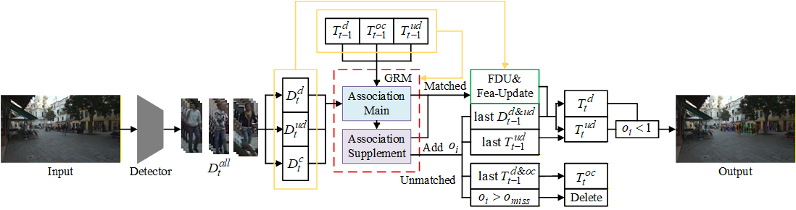

# RBO-Track

 [](https://opensource.org/licenses/MIT) 

#### RBO-Track is a Real-time multi-object tracking based on occlusion information.
 

## Abstract

Multi-object tracking aims to detect targets in videos and associate them correctly. Effectively associating valuable low confidence detections which is crucial for improving tracking quality by incorporating more targets and reducing identity switches—is often hindered by occlusion, a primary source of such detections. While existing state-of-the-art methods typically enhance the use of low-confidence detections only from the detection perspective, such as refining the association matrix or matching strategy, they underutilize the trajectory segments affected by these detections. To address this, we propose treating occlusion itself as valuable information to improve the overall association process. Based on our dedicated occlusion-aware trajectory classification, we derive the occlusion state of trajectories and introduce an occlusion-conditioned Global Re-matching (GRM) module. This module employs a strategy that decouples matching constraints from matching priorities, enabling the effective tracking of more low-confidence detections by leveraging occlusion cues. In the update stage after matching, we propose a Fine Detection Update (FDU) method that utilizes mutual occlusion relations between detections to address positional inaccuracies in high-confidence detections during early occlusion. By integrating these two components, we propose RBO-Track, a simple and real-time occlusion-aware multi-object tracking method. Experimental results on the MOT17 dataset demonstrate that our RBO-Track achieves state-of-the-art performance among methods without trajectory interpolation. Comprehensive evaluations on MOT17 and MOT20 confirm that RBO-Track effectively improves the tracking of low-confidence detections in low camera angle scenarios.
### Highlights

- RBO-Track is a **SOTA** heuristic trackers on MOT17 datasets.
- Maintains **Simple, Online and Real-Time (SORT)** characteristics.
- **Training-free** and **plug-and-play** manner.
- Introduced brand-new **occlusion information**.

### Pipeline

<center>

</center>

## Tracking performance

### Results on MOT17 challenge test set

| Tracker          | HOTA | IDF1 | MOTA | AssA |
|:-----------------|:----:|:----:|:----:|:----:|
| ByteTrack        | 63.1 | 77.3 | 80.3 | 62.0 |
| OC-SORT          | 63.2 | 77.5 | 78.0 | 63.2 |
| Hybrid-SORT-ReID | 64.0 | 78.7 | 79.9 | 63.5 |
| StrongSORT++     | 64.4 | 79.5 | 79.6 | 64.4 |
| Deep OC-SORT     | 64.9 | 80.6 | 79.4 | 65.9 |
| DeconfuseTrack   | 64.9 | 80.6 | 80.4 | 65.1 |
| SparseTrack      | 65.1 | 80.1 | 81.0 | 65.1 |
| RBO-Track        | 65.2 | 81.9 | 79.5 | 66.4 |

### Results on MOT20 challenge test set

| Tracker    | HOTA | IDF1 | MOTA | AssA |
|:-----------|:----:|:----:|:----:|:----:|
| ByteTrack  | 61.3 | 75.2 | 77.8 | 59.6 |
| OC-SORT    | 62.1 | 75.9 | 75.5 | 62.0 |
| RBO-Track  | 62.3 | 76.9 | 75.5 | 62.6 |

## Installation

RBO-Track code is based on [Hybrid-SORT](https://github.com/ymzis69/HybridSORT). Tested the code with Python 3.8 + torch 1.11.0.

Step1. Install RBO-Track

```shell
git clone https://github.com/forwardspeed/RBO-Track.git
cd RBO-Track-master
pip3 install -r requirements.txt
python3 setup.py develop
```

Step2. Install [pycocotools](https://github.com/cocodataset/cocoapi).

```shell
pip3 install cython; pip3 install 'git+https://github.com/cocodataset/cocoapi.git#subdirectory=PythonAPI'
```

Step3. Others

```shell
pip3 install cython_bbox pandas xmltodict
```

Step4. [optional] FastReID Installation

You can refer to [FastReID Installation](https://github.com/JDAI-CV/fast-reid/blob/master/INSTALL.md).

```shell
pip install -r fast_reid/docs/requirements.txt
```

## Data preparation

**Our data structure is the same as [OC-SORT](https://github.com/noahcao/OC_SORT).** 

1. Download [MOT17](https://motchallenge.net/), [MOT20](https://motchallenge.net/) and put them under <HYBRIDSORT_HOME>/datasets in the following structure:

   ```
   datasets
   |——————mot
   |        └——————train
   |        └——————test
   └——————MOT20
   |        └——————train
   |        └——————test
   ```

2. Prepare MOT17/MOT20 dataset. 

   ```python
   # convert MOT17 and MOT20 to CoCo
   python3 tools/convert_{mot17/mot20}_to_coco.py
   # build mixed training sets for MOT17 and MOT20 
   python3 tools/mix_data_{ablation/test_mot17/test_mot20}.py
   ```

## Model Zoo

Download and store the trained models in 'pretrained' folder as follow:

```
<HYBRIDSORT_HOME>/pretrained
```

### Detection Model

We provide some pretrained YOLO-X weights for RBO-Track, which are inherited from [ByteTrack](https://github.com/ifzhang/ByteTrack).

| Dataset         | HOTA | IDF1 | MOTA | Model                                                        |
| --------------- |------|------|------| ------------------------------------------------------------ |
| MOT17-half-val  | 69.6 | 83.5 | 78.4 | [Google Drive](https://drive.google.com/drive/folders/18IsZGeGiyKDshhYIzbpYXoNEcBhPY8lN?usp=sharing) |
| MOT17-test      | 65.2 | 81.9 | 79.5 | [Google Drive](https://drive.google.com/drive/folders/18IsZGeGiyKDshhYIzbpYXoNEcBhPY8lN?usp=sharing) |
| MOT20-test      | 62.3 | 76.9 | 75.5 | [Google Drive](https://drive.google.com/drive/folders/18IsZGeGiyKDshhYIzbpYXoNEcBhPY8lN?usp=sharing) |


* For more YOLO-X weights, please refer to the model zoo of [ByteTrack](https://github.com/ifzhang/ByteTrack).

### ReID Model

Ours ReID models for **MOT17/MOT20** is the same as [BoT-SORT](https://github.com/NirAharon/BOT-SORT) , you can download from [MOT17-SBS-S50](https://drive.google.com/drive/folders/18IsZGeGiyKDshhYIzbpYXoNEcBhPY8lN?usp=sharing), [MOT20-SBS-S50](https://drive.google.com/drive/folders/18IsZGeGiyKDshhYIzbpYXoNEcBhPY8lN?usp=sharing), ReID models for DanceTrack is trained by ourself, you can download from [DanceTrack](https://drive.google.com/drive/folders/18IsZGeGiyKDshhYIzbpYXoNEcBhPY8lN?usp=sharing).

**Notes**:


* [MOT20-SBS-S50](https://drive.google.com/drive/folders/18IsZGeGiyKDshhYIzbpYXoNEcBhPY8lN?usp=sharing) is trained by [Deep-OC-SORT](https://github.com/GerardMaggiolino/Deep-OC-SORT), because the weight from BOT-SORT is corrupted. Refer to [Issue](https://github.com/GerardMaggiolino/Deep-OC-SORT/issues/6).
* ReID models for DanceTrack is trained by ourself, with both DanceTrack and CUHKSYSU datasets.

## Tracking

**Notes**:


* We set  ```fp16==False``` on the MOT datasets becacuse fp16 will lead to significant result fluctuations.

### MOT17

**MOT17-val dataset**

```
# Hybrid-SORT
python3 tools/run_RBO_Track.py -f exps/example/mot/yolox_x_ablation_RBO_Track.py -b 1 -d 1 --fuse --expn $exp_name 
```

**MOT17-test dataset**

```
# Hybrid-SORT
python3 tools/run_RBO_Track.py -f exps/example/mot/yolox_x_mix_det_RBO_Track.py -b 1 -d 1 --fuse --expn $exp_name
```

### MOT20

**MOT20-test dataset**

```
#Hybrid-SORT
python tools/run_RBO_Track.py -f exps/example/mot/yolox_x_mix_mot20_ch_RBO_Track.py -b 1 -d 1 --fuse --mot20 --expn $exp_name 
```


## Citation

If you find this work useful, please consider to cite our paper:


## Acknowledgement

A large part of the code is borrowed from [YOLOX](https://github.com/Megvii-BaseDetection/YOLOX), [OC-SORT](https://github.com/noahcao/OC_SORT), [ByteTrack](https://github.com/ifzhang/ByteTrack), [Hybrid-SORT](https://github.com/ymzis69/HybridSORT), [FastReID](https://github.com/JDAI-CV/fast-reid) and [Hybrid-SORT](https://github.com/ymzis69/HybridSORT). Many thanks for their wonderful works.

